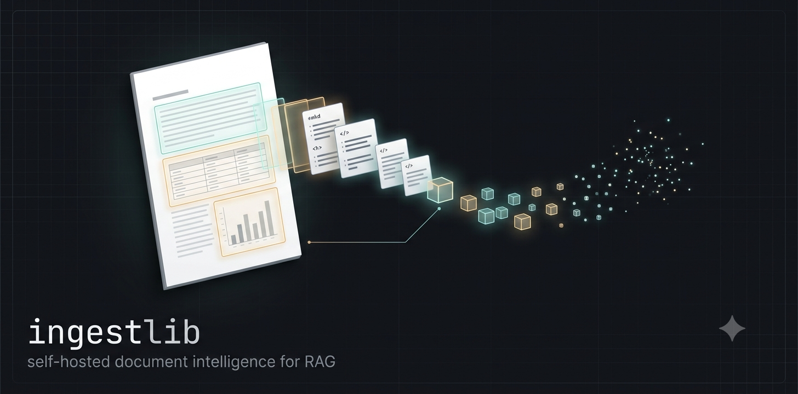

# ingestlib



Self-hosted document intelligence for RAG pipelines. One library that takes a
raw document — PDF, DOCX, PPTX — and produces searchable, **cited**,
retrieval-ready chunks: the territory of LlamaParse / Reducto /
Unstructured.io, running on your own stack.

```python
from ingestlib.services import ingest, retrieve

ingest("finance-10k.pdf")            # parse → classify → split → embed → vector store
result = retrieve("what were the total revenues?")
print(result.context)                # ranked chunks, each citing doc · page · section
```

## What it does

| Stage | What you get |
|---|---|
| **Parse** | Layout-aware markdown per page: tables as HTML (merged cells intact), formulas as LaTeX, **charts converted to data tables** (estimated values marked `~`, printed callouts and growth labels captured), figures extracted as PNG crops with captions and AI descriptions — every block traceable to a bounding box on the page |
| **Classify** | Document-type label (`invoice`, `research_paper`, …) — open-ended or constrained to your categories, with confidence and alternatives. Works standalone with **no OCR** |
| **Split** | Sections (pages grouped by role: `methods`, `results`, …) containing **natural chunks** — boundaries follow the content, tables never split, each chunk carries a `[category › section › heading]` breadcrumb in its `embedding_text` |
| **Ingest** | The whole pipeline in one call, every stage persisted to S3, vectors upserted, deduplicated by content checksum |
| **Retrieve** | Question → **hybrid search** (dense embeddings + lexical sparse, merged) → **Jina rerank** → hits with scores and citations, plus a prompt-ready context block |

Engines: **PaddleOCR-VL-1.6** (0.9B VLM, runs on your GPU) for layout + recognition,
**Amazon Nova 2 Lite** for judgment (chart reading, review, classification,
chunk boundaries), **Nova multimodal embeddings**, **Pinecone, Qdrant, or
SQLite** for vectors (all hybrid dense + sparse), **S3** for artifacts.
~$0.002/page in LLM spend.

## Quickstart

### 1. Requirements

- Python 3.12+ and [uv](https://github.com/astral-sh/uv)
- **AWS account** with Bedrock access (`us-east-1`): Nova 2 Lite + Nova 2
  multimodal embeddings
- **Vector database** — Pinecone account (serverless, free tier works;
  the default), a Qdrant server (local docker or Qdrant Cloud), or none at
  all: the sqlite connector stores vectors in a local file
- **Jina AI account** for reranking (free tier: 100 RPM)

### 2. Install

```bash
pip install ingestlib          # or: uv add ingestlib
```

Or work from source:

```bash
git clone https://github.com/LangModule/ingestlib.git
cd ingestlib
uv sync
```

System dependency — LibreOffice (DOCX/PPTX → PDF conversion):

```bash
brew install --cask libreoffice          # macOS (binary is `soffice`)
sudo apt install libreoffice-core libreoffice-writer libreoffice-impress   # Linux
```

### 3. Start the OCR inference server

Parse runs PaddleOCR-VL-1.6 behind an inference server. First launch downloads
~1.8 GB of weights; later launches load from cache in seconds.

```bash
# Apple Silicon (Metal GPU)
uv run python -m mlx_vlm.server --port 8111 --model PaddlePaddle/PaddleOCR-VL-1.6

# NVIDIA (then set paddle_vl.backend: vllm-server in config.yaml)
vllm serve PaddlePaddle/PaddleOCR-VL-1.6 --port 8111
```

The layout model (PP-DocLayoutV3, ~126 MB) auto-downloads on the first parse.

### 4. Configure

```bash
cp .env.example .env                 # API keys: Jina, plus Pinecone/Qdrant if used (sqlite needs none)
cp config.example.yaml config.yaml   # your AWS profile, bucket name, vector store choice
aws configure --profile your-aws-profile   # Bedrock-enabled credentials
```

Edit `config.yaml`: your AWS profile/account, S3 bucket name (globally
unique), vector store choice and index/collection names. **The S3 bucket and
the vector indexes/collection are created automatically on first use** — no
manual setup.

Config is discovered at call time, never at import: `INGESTLIB_CONFIG=/path/to/config.yaml`
wins, otherwise the working directory and its parents are searched — so
installed usage works the same as running inside this repo.

### 5. Run

```python
from ingestlib.services import ingest, retrieve

r = ingest("report.pdf")
print(r.status, r.category, r.chunks, r.durations)

res = retrieve("what does the report conclude?", top_k=5)
for hit in res.hits:
    print(hit.rerank_score, hit.citation, hit.chunk.heading)
```

## Using the operations directly

Every operation also works standalone:

```python
from ingestlib.operations import parse, classify, split

result = parse("report.pdf")            # ParseResult: pages, regions, figures
print(result.markdown)                  # whole-document markdown
result.save_images("out/")              # extracted figures/charts as PNGs

label = classify("report.pdf")          # no OCR needed — native text + embedded images
chunks = split(result, category=label.category)
for c in chunks.chunks:
    print(c.token_estimate, c.embedding_text.splitlines()[0])
```

Persistence and vector access are explicit too:

```python
from ingestlib.storage import artifacts, PineconeStore

doc_id = artifacts.save_parse(result)   # S3: source, result.json, page PNGs, crops
artifacts.list_documents()              # registry: filename, pages, category, chunks
```

## Architecture

```
src/ingestlib/
├── services/       ingest · retrieve          — the product
├── operations/     parse · classify · split   — the tools (each standalone)
├── storage/        artifacts (S3) · base (VectorStore contract) · pinecone · qdrant · sqlite
├── foundations/    llm (Bedrock Nova, Jina) · ocr (PaddleOCR-VL)
├── utils/          logger · files
└── config.py       config.yaml + .env → typed configs
```

Strict downward dependencies. The `VectorStore` contract means backends drop
in as connectors — all three ship **hybrid search**: **Pinecone** (dense +
hosted sparse model, merged client-side), **Qdrant** (dense + BM25 with
server-side IDF and RRF fusion; local docker or cloud), and **SQLite**
(sqlite-vec KNN + built-in FTS5 BM25 with porter stemming, RRF fusion — one
local file, no server, no keys). Pick one with `vector_store: pinecone |
qdrant | sqlite` in config.yaml. Cloud keys can sit in `.env` together
(sqlite needs none) — only the selected connector ever builds a client.

## Logging

```bash
INGESTLIB_LOG_LEVEL=INFO           # DEBUG | INFO | WARNING | ERROR (default INFO)
INGESTLIB_LOG_THIRD_PARTY=1        # also show paddlex/httpx/botocore chatter
INGESTLIB_LOG_COLOR=0              # disable colored output
```

## Testing

Tests hit **real APIs, never mocks**. Pure logic runs always; server-hitting
suites are opt-in via env gates. The sqlite connector's full suite runs
ungated in `make test` — there is no server, so in-process IS the real thing.

```bash
make test                  # fast suite (~200 tests, ~90s; e2e groups skip)
make test-parse            # parse e2e            (needs VL server + Bedrock)
make test-classify         # classify e2e         (needs Bedrock)
make test-split            # split e2e            (needs Bedrock)
make test-s3               # artifact store e2e   (needs AWS)
make test-pinecone         # vector connector e2e (needs Pinecone + Bedrock)
make test-qdrant           # vector connector e2e (needs a Qdrant server + Bedrock)
make test-sqlite           # vector connector suite (no gate — nothing to need)
make test-services         # full product e2e     (needs the entire stack)
make test-all              # everything
make eval                  # retrieval quality eval (see below)
```

Fixture PDFs live in `tests/data/pdf/` — 14 real documents (research papers,
earnings decks, insurance forms, timetables, 10-Ks).

### Retrieval quality

Beyond pass/fail tests, `evals/` measures retrieval quality: 22 ground-truth
questions over the fixture corpus, run through the real `retrieve()` flow
under dense/hybrid × rerank on/off, scored by hit@k and MRR. Measured so far
(consistent across all three connectors): **with reranking, every answer
lands in the top 3 hits (hit@3 = 1.00)**; hit@1 ranges 0.86–1.00 across runs.
Each run saves a timestamped snapshot to `evals/results/`, so quality changes
are visible over time.

## Disk footprint

| Component | Size | Location |
|---|---|---|
| Python deps | ~3 GB | `.venv/` |
| PaddleOCR-VL-1.6 weights | ~1.8 GB | `~/.cache/huggingface/hub/` |
| PP-DocLayoutV3 | ~126 MB | `~/.paddlex/official_models/` |
| LibreOffice | ~600 MB | system |

## Scope

English documents; PDF / DOCX / PPTX input. Images, charts, and tables
**inside** documents are fully extracted and interpreted; direct image files
and handwriting are out of scope by design.

## Roadmap

- Hover-highlight review UI (bbox provenance already shipped for it)
- Extract: schema-driven field extraction with source provenance

## License

See [LICENSE](./LICENSE).
