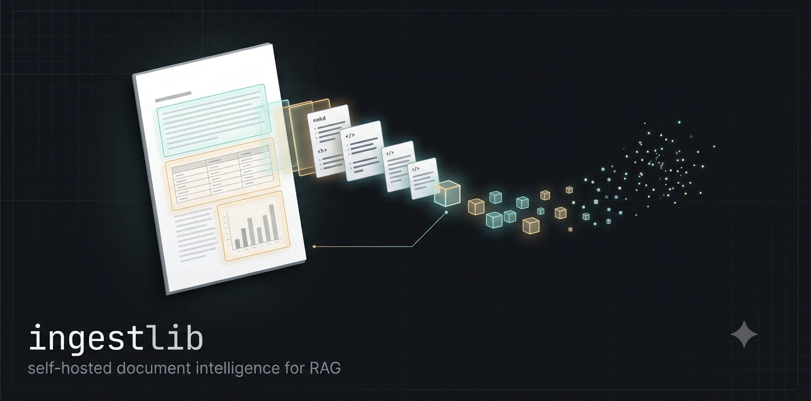

# ingestlib



Self-hosted document intelligence for RAG pipelines. One library that takes a
raw document — PDF, DOCX, PPTX, or a PNG/JPEG/WebP image — and produces
searchable, **cited**, retrieval-ready chunks, plus schema-driven
extraction with verified citations: the territory of LlamaParse /
Reducto / Unstructured.io, running on your own stack.

```python
from ingestlib.services import ingest, retrieve

ingest("finance-10k.pdf")            # parse → classify → split → embed → vector store
result = retrieve("what were the total revenues?")
print(result.context)                # ranked chunks, each citing doc · page · section
```

**Documentation: [langmodule.github.io/ingestlib](https://langmodule.github.io/ingestlib/)** —
guides for every stage, the full configuration reference, and the API docs.

## What it does

| Stage | What you get |
|---|---|
| **Parse** | Layout-aware markdown per page: tables as HTML (merged cells intact), formulas as LaTeX, **charts converted to data tables** (estimated values marked `~`, printed callouts and growth labels captured), figures extracted as PNG crops with captions and AI descriptions — every block traceable to a bounding box on the page |
| **Classify** | Document-type label (`invoice`, `research_paper`, …) — open-ended, or constrained to your rules (per call or preset in `rules.yaml`, with page targeting) — confidence and ranked alternatives included. Works standalone with **no OCR** |
| **Split** | Sections (pages grouped by role: `methods`, `results`, … — LLM-discovered, or **your own categories** via rules) containing **natural chunks** — boundaries follow the content, tables never split, each chunk carries a `[category › section › heading]` breadcrumb in its `embedding_text` |
| **Extract** | **Your Pydantic schema, filled from the document** — one instance (`mode="one"`) or every instance in a batch (`mode="many"`, e.g. all receipts in a scanned expense bundle). Every field carries **verified provenance**: page + region citations checked against the parse, values grounded in the cited source text, and honest confidence — uncited or ungrounded answers are capped, hallucinated citations dropped |
| **Ingest** | The whole pipeline in one call, every stage persisted to the artifact store (S3 or a local folder), vectors upserted, deduplicated by content checksum |
| **Retrieve** | Question → **hybrid search** (dense embeddings + lexical sparse, merged) → **rerank** (Jina by default; Amazon Rerank or none via `reranker:` in config.yaml) → hits with scores and citations, plus a prompt-ready context block |

Engines: **PaddleOCR-VL-1.6** (0.9B VLM, runs on your GPU) for layout + recognition,
**Amazon Nova 2 Lite** for judgment (chart reading, review, classification,
chunk boundaries), **Nova multimodal embeddings**, **eight vector stores**
(Pinecone, Qdrant, SQLite, Postgres/pgvector, MongoDB, Milvus, OpenSearch,
Weaviate — all hybrid dense + sparse), **S3 or a local folder** for
artifacts (`artifact_store: s3 | local`). ~$0.002/page in LLM spend. An
**OpenAI backend** (GPT-5 vision-capable chat + text-embedding-3) ships
alongside Bedrock — flip `llm_provider: openai` / `embedding_provider:
openai` to run the whole pipeline on it instead — or `ollama` to keep
every LLM call on your own machine. See below.

## Quickstart

### 1. Requirements

- Python 3.12+ and [uv](https://github.com/astral-sh/uv)
- **AWS account** with Bedrock access (`us-east-1`): Nova 2 Lite + Nova 2
  multimodal embeddings — the default provider; the OpenAI backend or a
  local Ollama can run the whole pipeline instead (see below)
- **Vector database** — none at all by default: the sqlite connector
  stores vectors in a local file. Or a Pinecone account (serverless,
  free tier works), a Qdrant server (local docker or Qdrant Cloud), a Postgres
  with pgvector (RDS/Supabase/Neon or self-hosted), a MongoDB with search
  (Atlas any tier or 8.2+ self-managed), a Milvus (local docker or Zilliz
  Cloud), an OpenSearch (Amazon domain or local docker), a Weaviate (local
  docker or Weaviate Cloud) — each just one connection URL
- **Jina AI account** for reranking (free tier: 100 RPM) — the default; or set
  `reranker: aws` (Amazon Rerank, same AWS credentials) or `reranker: none`
  in config.yaml and skip Jina entirely

### 2. Install

```bash
uv add ingestlib               # or: pip install ingestlib
```

The core install covers the full default stack (including sqlite vectors).
Server-backed vector stores are extras — add the one you'll use:

```bash
uv add "ingestlib[qdrant]"     # pinecone · qdrant · pgvector · mongodb
                               # · milvus · opensearch · weaviate · all
```

Or work from source:

```bash
git clone https://github.com/LangModule/ingestlib.git
cd ingestlib
uv sync
```

System dependency — LibreOffice (DOCX/PPTX → PDF conversion):

```bash
brew install --cask libreoffice          # macOS (binary is `soffice`)
sudo apt install libreoffice-core libreoffice-writer libreoffice-impress   # Linux
```

### 3. Start the OCR inference server

Parse runs PaddleOCR-VL-1.6 behind an inference server. First launch downloads
~1.8 GB of weights; later launches load from cache in seconds.

```bash
# Apple Silicon (Metal GPU)
uv run python -m mlx_vlm.server --port 8111 --model PaddlePaddle/PaddleOCR-VL-1.6

# NVIDIA (then set paddle_vl.backend: vllm-server in config.yaml)
vllm serve PaddlePaddle/PaddleOCR-VL-1.6 --port 8111
```

The layout model (PP-DocLayoutV3, ~126 MB) auto-downloads on the first parse.

### 4. Configure

`ingestlib init` scaffolds the setup files into the current directory:

```bash
uv run ingestlib init            # default stack: Bedrock + sqlite + Jina → config.yaml + .env
uv run ingestlib init --local    # zero-cloud: Ollama + sqlite + local artifacts — no keys at all
```

For the default stack, add Bedrock-enabled credentials:

```bash
aws configure --profile your-aws-profile
```

Edit `config.yaml`: pick your providers, vector store, reranker, and
artifact store — everything else has working defaults (`vector_store:
sqlite` needs no server and no keys) — and fill `.env` with the keys your
choices need (Jina for the default reranker; `--local` needs none). The `aws` section is required only
while a choice uses AWS (the default bedrock provider, s3 artifacts, the
aws reranker, an Amazon OpenSearch domain) — delete it otherwise and the
config loader will tell you if something still needs it. **The S3 bucket
(default `ingestlib-{account_id}`) and the vector indexes/collections are
created automatically on first use** — no manual setup. Prefer no cloud
storage at all? `artifact_store: local` keeps every parse, page image, and
chunk in a plain folder beside your config.yaml — browsable in a file
manager, and moving a corpus between backends is a copy.

Config is discovered at call time, never at import: `INGESTLIB_CONFIG=/path/to/config.yaml`
wins, otherwise the working directory and its parents are searched — so
installed usage works the same as running inside this repo.

### 5. Verify

```bash
uv run ingestlib doctor
```

Doctor checks every configured choice with real calls — config discovery,
LibreOffice, the OCR server, an LLM ping, an embedding (with its dimension),
the reranker, the artifact store, and the vector store. Every failed line
prints the one-sentence fix (wrong AWS profile → your available profiles,
missing key → where to get one, model not pulled → the exact `ollama pull`).

### 6. Run

```python
from ingestlib.services import ingest, retrieve

r = ingest("report.pdf")
print(r.status, r.category, r.chunks, r.durations)

res = retrieve("what does the report conclude?", top_k=5)
for hit in res.hits:
    print(hit.rerank_score, hit.citation, hit.chunk.heading)
```

## Manage a corpus

Real corpora change. Re-ingesting an edited file **replaces** the old version
(its vectors and artifacts are deleted — no stale chunks), a rename is a cheap
**move**, and `sync()` reconciles a whole folder in one call:

```python
from ingestlib.services import ingest, sync, remove, backfill

ingest("report.pdf")                       # edited file → status="replaced"
sync("corpus/", prune=True)                # add new, replace changed, drop deleted
remove("old.pdf")                          # erase one doc from both stores
backfill()                                 # rebuild the vector store from artifacts
```

The same verbs are on the CLI — a corpus is managed from the shell, no Python
needed:

```bash
ingestlib ingest report.pdf docs/          # files or folders
ingestlib sync corpus/ --prune --dry-run   # preview, then drop --dry-run
ingestlib list                             # every stored document
ingestlib remove report.pdf                # erase one
ingestlib backfill                         # rebuild the index (provider switch, new store)
ingestlib search "what were the risks?"    # cited retrieval from the shell
```

Documents carry a logical identity (`namespace` + source path), so lifecycle
knows a re-ingest from a brand-new file. Full guide:
[Manage a corpus](https://langmodule.github.io/ingestlib/how-to/manage-corpus/).

## Using the operations directly

Every operation also works standalone:

```python
from ingestlib.operations import parse, classify, split

result = parse("report.pdf")            # ParseResult: pages, regions, figures
print(result.markdown)                  # whole-document markdown
result.save_images("out/")              # extracted figures/charts as PNGs

label = classify("report.pdf")          # no OCR needed — native text + embedded images
chunks = split(result, category=label.category)
for c in chunks.chunks:
    print(c.token_estimate, c.embedding_text.splitlines()[0])
```

And the fourth operation pulls **structured data** out — your schema,
filled and cited:

```python
from pydantic import BaseModel
from ingestlib.operations import extract

class Receipt(BaseModel):
    merchant: str
    total: float
    currency: str

report = extract(parse("expenses.pdf"), schema=Receipt, mode="many")
for item in report.items:
    print(item.value.merchant, item.value.total, item.citation)
# BART 20.0 p.10  ·  Hilton 214.6 p.2  ·  …
print(report.items[0].fields["total"].grounded)   # True — verified in the cited region
```

`mode="one"` fills a single instance from the whole document (a 10-K's
headline financials); `mode="many"` finds every instance across the pages.
A `ParseResult` input gives region-level citations on scans; a raw path
reads the native text layer with page-level citations and no OCR server.
Confidence is honest: a field whose citation doesn't check out is capped,
and a value not found in its cited text is flagged `grounded=False`.

Persistence and vector access are explicit too:

```python
from ingestlib.storage import artifacts

doc_id = artifacts.save_parse(result)   # artifact store: source, result.json, page PNGs, crops
artifacts.save_extract(doc_id, report)  # extraction results persist beside the parse
artifacts.list_documents()              # registry: filename, pages, category, chunks
```

## Classification & split rules

Classify and split are open-ended by default — the LLM decides the document
type and discovers the section vocabulary. Both can instead follow **your**
rules: pass them per call, or preset them once in `rules.yaml` beside your
config.yaml, and every bare call **and the whole ingest pipeline** uses
them automatically:

```python
classify("doc.pdf",
         {"invoice": "Itemized charges, tax info, and payment terms",
          "sec_filing": "10-K/10-Q style regulatory filings"},
         target_pages="1,3,5-7", max_pages=5)   # read only these pages
```

```python
split("report.pdf",
      vocabulary={"financial_statements": "Balance sheets, income statements",
                  "notes": "Footnotes and disclosures"},
      unmatched="other")   # pages fitting nothing: other (default) | require | skip
```

```yaml
# rules.yaml — beside your config.yaml; infra stays in config.yaml,
# what your documents MEAN lives here
classify:
  max_pages: 5
  rules:                       # up to 20 — result is one of these or "uncategorized"
    invoice: "Itemized charges, tax info, and payment terms"
    sec_filing: "10-K/10-Q style regulatory filings"
split:
  unmatched: other             # require | other | skip
  categories:                  # up to 50 — YOUR sections; Pass 1 is skipped
    financial_statements: "Balance sheets, income statements, cash flows"
    notes: "Footnotes and disclosures"
```

Classify returns one of your labels or `"uncategorized"`, with confidence,
reasoning, and ranked alternatives. Split labels every page against your
sections — unmatched pages become an honest `other` section (default), get
forced into the nearest category (`require`), or are dropped entirely
(`skip`). Precedence everywhere: explicit arguments beat the preset, and
`{}` forces the open-ended default even when a preset exists.

## OpenAI backend

The same LLM surface Bedrock provides is also available on OpenAI — GPT-5
chat with vision, thinking mode, schema-enforced structured output, and
text-embedding-3 embeddings. Add `OPENAI_API_KEY` to `.env` and pick models
in config.yaml's `openai:` section (defaults: `gpt-5-mini`,
`text-embedding-3-small`).

To run the whole `ingest`/`retrieve` pipeline on it, switch the providers
in config.yaml — every LLM and embedding call routes accordingly:

```yaml
llm_provider: openai          # chart reading, review, classify, chunking
embedding_provider: openai    # chunk + query embeddings
```

Combined with `artifact_store: local`, `vector_store: sqlite`, and
`reranker: jina` (or `none`), the pipeline needs no AWS at all. Two rules:
switching `embedding_provider` changes the vector space, so re-ingest
afterward (`skip_existing=False`) — vectors from different embedding models
never mix in one index. And text embeddings only: OpenAI has no
image-embedding model.

The backend is also importable directly, ignoring the config switch:

```python
from ingestlib.foundations.llm import Image
from ingestlib.foundations.llm.openai import chat, chat_structured, embed_text

chat("Read this chart", images=[Image(png_bytes, "png")])   # vision works
embed_text("a chunk of text")                               # 1024-dim default
```

## Local backend (Ollama)

The third provider keeps every LLM call on your machine — the fully
air-gapped pipeline. Point config.yaml at a local
[Ollama](https://ollama.com) (or any OpenAI-compatible server: vLLM,
LM Studio):

```yaml
llm_provider: ollama
embedding_provider: ollama

ollama:                                    # these are the defaults
  base_url: http://localhost:11434/v1
  llm_model_id: qwen3.5:9b
  embedding_model_id: qwen3-embedding:0.6b
```

```bash
ollama pull qwen3.5:9b
ollama pull qwen3-embedding:0.6b
```

No API key. Vision, schema-enforced structured output, and 1024-dim
embeddings all verified on the reference stack — and **local embedding
quality is measured, not assumed**: on the retrieval eval, qwen3-embedding
matched or beat the cloud stack (perfect reranked hit@1/3/5 = 1.00). Two
honest notes: use the GGUF builds, not `-mlx` (Ollama's MLX engine
silently drops images and schema enforcement), and a local 9B won't match
the cloud models on dense charts — test with your own documents before
committing.
Combined with `artifact_store: local` and `vector_store: sqlite`,
nothing leaves your machine but the optional Jina rerank call
(`reranker: none` closes even that).

## Architecture

```
src/ingestlib/
├── services/       ingest · retrieve · lifecycle (remove · sync · backfill) — the product
├── operations/     parse · classify · split · extract — the tools (each standalone)
├── storage/        artifacts (S3 | local) · base (VectorStore contract) · 8 connectors
│                   (pinecone · qdrant · sqlite · pgvector · mongodb · milvus
│                    · opensearch · weaviate)
├── foundations/    llm (Bedrock Nova · OpenAI GPT-5 · Ollama Qwen · Jina) · ocr (PaddleOCR-VL)
├── cli/            the `ingestlib` command — init · doctor · ingest · sync · list · remove · backfill · search
├── utils/          logger · files · sync · aws
└── config.py       config.yaml + .env + rules.yaml → typed configs
```

Strict downward dependencies. The `VectorStore` contract means backends drop
in as connectors — all eight ship **hybrid search**: **Pinecone** (dense +
hosted sparse model, merged client-side), **Qdrant** (dense + BM25 with
server-side IDF and RRF fusion; local docker or cloud), **SQLite**
(sqlite-vec KNN + built-in FTS5 BM25 with porter stemming, RRF fusion — one
local file, no server, no keys), **Postgres/pgvector** (HNSW cosine +
built-in full-text over a generated weighted tsvector, RRF fusion — the
extension and table bootstrap automatically), **MongoDB** (Atlas Vector
Search + Atlas Search true BM25, RRF fusion — Atlas any tier or self-managed
8.2+; both search indexes bootstrap automatically), **Milvus** (dense
ANN + server-computed BM25 sparse, fused server-side with RRF — local docker
or Zilliz Cloud), **OpenSearch** (faiss HNSW k-NN + Lucene BM25, RRF fused
client-side — an Amazon OpenSearch domain SigV4-signed with your aws
profile, or local docker), and **Weaviate** (HNSW dense + native BM25 fused
server-side in one hybrid call — local docker or Weaviate Cloud). Pick one
with `vector_store: pinecone | qdrant | sqlite | pgvector | mongodb |
milvus | opensearch | weaviate` in config.yaml. Connection secrets sit in
`.env` together (sqlite needs none) — only the selected connector ever
builds a client.

## Logging

```bash
INGESTLIB_LOG_LEVEL=INFO           # DEBUG | INFO | WARNING | ERROR (default INFO)
INGESTLIB_LOG_THIRD_PARTY=1        # also show paddlex/httpx/botocore chatter
INGESTLIB_LOG_COLOR=0              # disable colored output
```

## Testing

Tests hit **real APIs, never mocks**. Pure logic runs always; server-hitting
suites are opt-in via env gates. The sqlite connector's full suite runs
ungated in `make test` — there is no server, so in-process IS the real thing.

```bash
make test                  # fast suite (~530 tests, ~3min; e2e groups skip)
make test-openai           # OpenAI backend       (skips without OPENAI_API_KEY)
make test-ollama           # Ollama backend       (needs a local Ollama + models)
make test-parse            # parse e2e            (needs VL server + LLM provider)
make test-classify         # classify e2e         (needs the LLM provider)
make test-split            # split e2e            (needs the LLM provider)
make test-extract          # extract e2e          (needs the LLM provider; scans need the VL server)
make test-s3               # artifact store e2e   (needs AWS)
make test-pinecone         # vector connector e2e (needs Pinecone + embeddings)
make test-qdrant           # vector connector e2e (needs a Qdrant server + embeddings)
make test-sqlite           # vector connector suite (no gate — nothing to need)
make test-pgvector         # vector connector e2e (needs Postgres at PGVECTOR_URL)
make test-mongodb          # vector connector e2e (needs MongoDB at MONGODB_URL)
make test-milvus           # vector connector e2e (needs Milvus at MILVUS_URL)
make test-opensearch       # vector connector e2e (needs OpenSearch at OPENSEARCH_URL)
make test-weaviate         # vector connector e2e (needs Weaviate at WEAVIATE_URL)
make test-services         # full product e2e     (needs the entire stack)
make test-cli              # CLI: init/doctor + corpus commands (no gate)
make test-lifecycle        # remove/sync/backfill + replace-aware ingest (no gate)
make test-all              # everything
make eval                  # retrieval quality eval (see below)
make docs                  # live-preview the documentation site
```

Fixtures live in `tests/data/` — 15 real PDFs (research papers, earnings
decks, insurance forms, 10-Ks, a 16-page receipt scan, a password-protected
one), document images incl. WebP, and real DOCX/PPTX files. The
server-backed connector suites need their servers:
`docker compose -f infra/docker-compose.yml --profile all up -d` starts
every local store (or `--profile qdrant` etc. for just one).

### Retrieval quality

Beyond pass/fail tests, `evals/` measures retrieval quality: 22 ground-truth
questions over the fixture corpus, run through the real `retrieve()` flow
under dense/hybrid × rerank on/off, scored by hit@k and MRR. Measured so far
(consistent across all eight connectors): **with reranking, every answer
lands in the top 3 hits (hit@3 = 1.00)**; hit@1 ranges 0.86–1.00 across runs.
The fully-local stack holds the same bar — Ollama embeddings scored a
perfect 1.00 across hit@1/3/5 and MRR on dense+rerank.
Each run saves a timestamped snapshot to `evals/results/`, so quality changes
are visible over time.

## Disk footprint

| Component | Size | Location |
|---|---|---|
| Python deps | ~1.4 GB core (+ your vector-store extra) | `.venv/` |
| PaddleOCR-VL-1.6 weights | ~1.8 GB | `~/.cache/huggingface/hub/` |
| PP-DocLayoutV3 | ~126 MB | `~/.paddlex/official_models/` |
| LibreOffice | ~600 MB | system |

## Scope

English documents; PDF / DOCX / PPTX / PNG / JPEG / WebP input. Images,
charts, and tables **inside** documents are fully extracted and interpreted,
and a single image file parses as a one-page document; handwriting is out
of scope by design.

## The studio

[ingestlib-studio](https://github.com/LangModule/ingestlib-studio) is the
visual companion: a local web UI with a setup wizard, try-before-you-commit
pipeline runs, page-by-page review with hover-to-highlight bounding boxes,
committed ingestion with live progress, a content-rules editor, and a
retrieval playground where every answer points to its source on the page.

## Roadmap

- 100-page hardening: streaming / checkpointed parse for large documents
- XLSX input (tables-first, not a PDF conversion)

Recently shipped: document lifecycle — replace-aware ingestion, folder `sync()`,
`backfill()`, and the corpus CLI (v1.1).

## License

See [LICENSE](./LICENSE).
